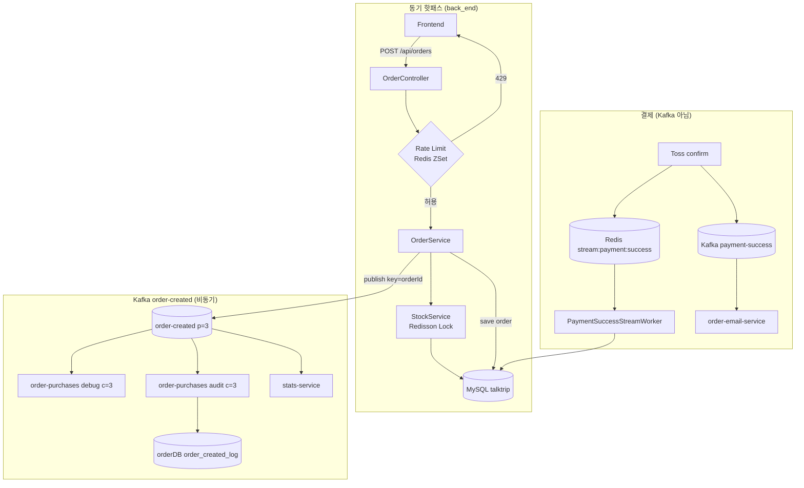

# 특가·몰림 트래픽 대응 정리

상품 특가 오픈 등으로 **동시 주문이 급증할 때** 시스템이 어떻게 동작하는지,  
**기존 구조의 한계**, **추가로 적용한 개선**, **앞으로 검토할 항목**을 한 문서로 정리합니다.

> 이 문서는 `talktrip-order-purchases-service` docs에 두었지만, 실제 **핫패스(주문·재고·결제)** 는 `tt/back_end`와 `tt/front_end`에 있습니다.  
> 본 서비스는 Kafka **감사(audit) Consumer** 역할만 담당합니다.

---

## 1. 질문에서 출발: Kafka로 감당될까?

### 결론 (한 줄)

**Kafka 브로커/토픽 자체는 순간 트래픽을 버퍼링하는 데 충분히 강하지만, 특가 몰림의 실제 병목은 Kafka가 아닙니다.**

| 구간 | 특가 몰림 시 | 판단 |
|------|-------------|------|
| Kafka `order-created` | 파티션 3, key=`orderId` | 메시지 적재·fan-out **대체로 OK** |
| `back_end` 주문 API | 옵션별 Redis 분산락 → **직렬 처리** | **가장 먼저 병목** |
| `order-purchases-service` | audit INSERT | consumer lag 가능, **주문 성공/실패와 무관** |
| 결제 후처리 | Redis Stream + 단일 워커 | 결제 많으면 **확정 지연** 가능 |

---

## 2. 전체 주문·구매 파이프라인



### Phase A — 주문 생성 (동기, Kafka 이전)

1. `POST /api/orders/{productId}` → [`OrderController`](../../tt/back_end/src/main/java/com/talktrip/talktrip/domain/order/controller/OrderController.java)
2. [`StockService.checkStockAndDecrease`](../../tt/back_end/src/main/java/com/talktrip/talktrip/domain/product/service/StockService.java) — Redisson `lock:stock:{productOptionId}`, wait 5초
3. 주문 DB 저장
4. [`OrderEventPublisher.publishOrderCreated`](../../tt/back_end/src/main/java/com/talktrip/talktrip/domain/event/order/OrderEventPublisher.java) → Kafka 발행 (**실패해도 주문 롤백 안 함**)

### Phase B — `order-created` fan-out

동일 토픽을 **서로 다른 consumer group**이 병렬 소비:

| Consumer Group | 서비스 | 처리 |
|----------------|--------|------|
| `debug-order-created-consumer` | **order-purchases** | INFO 로그 |
| `audit-order-created-consumer` | **order-purchases** | `order_created_log` INSERT |
| `talktrip-stats-streams-app` | stats-service | 30분 TOP30 집계 |
| `talktrip-stats-redis-order-purchase` | stats-service | Redis ZINCRBY |

### Phase C — 결제 확정

- DB 확정: **Redis Stream** `stream:payment:success` → [`PaymentSuccessStreamWorker`](../../tt/back_end/src/main/java/com/talktrip/talktrip/domain/order/service/PaymentSuccessStreamWorker.java)
- Kafka `payment-success`: 이메일 등 부가 처리 (`order-email-service`)
- **order-purchases-service는 결제 경로에 관여하지 않음**

---

## 3. talktrip-order-purchases-service 역할 (기존)

- **Producer 없음**, HTTP API 없음
- `order-created` 토픽만 구독 → `orderDB.order_created_log` 감사 적재
- 포트 `8085`, DB `orderDB`
- 상세: [`kafka.md`](kafka.md), [`README.md`](README.md)

특가 때 이 서비스가 **느려져도** 사용자 주문 HTTP 응답은 이미 끝난 뒤이므로, **구매 성공/실패를 Kafka가 결정하지 않습니다.**

---

## 4. 기존 구조의 병목 (개선 전)

### 4.1 재고 — Redis 분산락 (이미 존재)

```text
lock:stock:{productOptionId}
LOCK_WAIT_MS = 5_000
LOCK_LEASE_MS = 30_000
```

- 같은 옵션 주문은 **한 번에 하나만** 재고 차감
- 5초 내 락 미획득 → `"재고 처리 중입니다. 잠시 후 다시 시도해주세요."`
- **오버셀 방지에 필수**, 동시에 **처리량을 의도적으로 직렬화**

### 4.2 DB 커넥션

- `back_end` Hikari `maximum-pool-size: 10`
- `order-purchases-service` Hikari `maximum-pool-size: 10`

### 4.3 Kafka Consumer (order-purchases) — 개선 전

| 항목 | 기존 값 |
|------|---------|
| `concurrency` | **1** (debug / audit 각각) |
| 토픽 파티션 | 3 |
| batch insert | 없음 (건당 INSERT + LOB JSON) |
| 멱등 UNIQUE | 없음 (at-least-once 시 중복 row 가능) |

파티션 3개인데 concurrency 1 → **인스턴스당 1파티션만 소비**, audit lag 쌓이기 쉬움.

### 4.4 결제 워커

- Consumer: `worker-1` (단일)
- Polling: `fixedDelay = 2000ms`, batch `count(10)`
- 이론상 초당 수 건 수준 후처리

### 4.5 API 진입 제한 — 개선 전

- Rate limiting **없음**
- 특가 클릭/새로고침이 그대로 재고 락·DB로 전달

### 4.6 프론트 UX — 개선 전

- 주문 생성 중: 버튼 텍스트 `"주문 생성 중..."` 만
- 재고/429 오류: `alert()` 로만 표시
- 재고 락 대기(최대 5초) 동안 **전용 대기 UI 없음**

---

## 5. 추가로 적용한 개선 (2026-05)

### 5.1 Kafka Consumer concurrency 1 → 3

**파일:** [`OrderCreatedDebugConsumer.java`](../src/main/java/org/example/talktriporderpurchasesservice/messaging/consumer/OrderCreatedDebugConsumer.java)

```java
@KafkaListener(..., concurrency = "3") // order-created 토픽 파티션 3개
```

- debug / audit **양쪽 모두** concurrency=3
- `product-click-service`와 동일 패턴
- **효과:** 인스턴스 1대 기준 audit INSERT 처리량 최대 약 3배, consumer lag 완화
- **한계:** 주문 핫패스 병목은 여전히 `back_end` 재고·DB

### 5.2 프론트 — 대기 오버레이 (`WaitingOverlay`)

**파일:** [`tt/front_end/src/common/components/WaitingOverlay.jsx`](../../tt/front_end/src/common/components/WaitingOverlay.jsx)

| 화면 | 표시 시점 | 안내 |
|------|-----------|------|
| `CommercePayment` | `isCreatingOrder` | "주문이 많아 재고 확인에 시간이 걸리고 있어요..." |
| `Checkout` | 위젯 준비 / 결제 진행 | 단계별 안내 |
| `OrderSuccess` | 결제 승인 API | "페이지를 닫지 말고..." |

- 풀스크린 스피너 + **"기다려주세요" + bounce 점 애니메이션**
- 1.5~2초 후 추가 안내 문구 표시

### 5.3 API 진입 제한 — Redis Sorted Set 슬라이딩 윈도우

**위치:** `tt/back_end` (주문 API 앞단)

| 파일 | 역할 |
|------|------|
| [`RedisSlidingWindowRateLimiter.java`](../../tt/back_end/src/main/java/com/talktrip/talktrip/global/redis/RedisSlidingWindowRateLimiter.java) | ZSet rate limit 공통 로직 |
| [`OrderRateLimitProperties.java`](../../tt/back_end/src/main/java/com/talktrip/talktrip/global/redis/OrderRateLimitProperties.java) | 설정 |
| [`OrderRateLimitRedisKeys.java`](../../tt/back_end/src/main/java/com/talktrip/talktrip/global/redis/OrderRateLimitRedisKeys.java) | Redis key 규칙 |
| [`OrderController.java`](../../tt/back_end/src/main/java/com/talktrip/talktrip/domain/order/controller/OrderController.java) | 주문 생성 전 검사 |
| [`ErrorCode.TOO_MANY_REQUESTS`](../../tt/back_end/src/main/java/com/talktrip/talktrip/global/exception/ErrorCode.java) | HTTP 429 |

#### 알고리즘 (Sliding Window)

```text
1. removeRangeByScore(key, 0, now - windowMs)   // 윈도 밖 member 삭제
2. add(key, requestId(UUID), now)               // 현재 요청 추가
3. size(key)                                    // 윈도 내 요청 수
4. expire(key, windowMs)                        // TTL
5. count > maxRequests → remove(requestId), 거부
```

#### Redis key (회원 + 상품 분리)

```text
rate_limit:order:member:{memberId}:product:{productId}
```

- 같은 회원이라도 **상품별**로 제한 카운트 분리
- 다른 상품 주문에는 영향 없음

#### 기본 설정 (`application.yml`)

```yaml
talktrip:
  rate-limit:
    order:
      enabled: true
      window-ms: 10000      # 10초
      max-requests: 5       # 10초당 5회
```

환경 변수:

- `TALKTRIP_ORDER_RATE_LIMIT_ENABLED`
- `TALKTRIP_ORDER_RATE_LIMIT_WINDOW_MS`
- `TALKTRIP_ORDER_RATE_LIMIT_MAX`

#### 운영 정책

- **Redis 장애 시 fail-open** — rate limit 실패해도 주문 API는 동작
- 초과 시: `429` + `"요청이 많아 잠시 후 다시 시도해주세요."`
- 프론트 [`orderApi.jsx`](../../tt/front_end/src/common/api/orderApi.jsx)에서 429 메시지 처리

---

## 6. 검토했으나 추가하지 않은 것

### Redis lock 추가 (주문/Kafka 경로)

- **재고 경로에는 이미** `StockService` Redisson 락 존재
- lock을 더 넣으면 **동시 처리량만 줄어듦** (특가 대응과 반대)
- Kafka audit consumer에 lock 불필요 (파티션 병렬 소비가 맞음)
- 멱등은 lock보다 **DB UNIQUE `(topic, partition, offset)`** 이 적합

---

## 7. 특가 몰림 시 사용자/시스템 관점 시나리오

### 같은 옵션 1000명 동시 클릭, 재고 100개

1. **Rate limit** — 회원·상품당 10초 5회 → 연속 클릭/새로고침 일부 429
2. **재고 락** — 옵션당 직렬 → 약 100명 성공, 나머지 재고 부족 또는 5초 대기 후 `"재고 처리 중"`
3. **주문 성공분** — DB 저장 후 Kafka `order-created` 발행
4. **order-purchases** — concurrency 3으로 audit lag 완화 (주문과 비동기)
5. **결제** — Redis Stream 워커 처리량에 따라 확정 지연 가능

### Kafka만 보면

- 브로커는 메시지를 **버퍼**로 쌓음
- Consumer lag는 **감사·통계 지연**이지, **주문 실패**를 의미하지 않음

---

## 8. 앞으로 검토할 항목 (미적용)

| 항목 | 목적 | 비고 |
|------|------|------|
| Redis Lua **atomic 재고 선차감** | lock+DB보다 빠른 재고 처리 | `DECR` / Lua script |
| `order_created_log` **UNIQUE** | Kafka 재처리 시 중복 INSERT 방지 | `(kafka_topic, partition, offset)` |
| **PaymentSuccessStreamWorker** 다중 consumer | 결제 확정 처리량 확장 | orderCode 멱등 키 필요 |
| audit **batch insert** | DB write throughput | |
| API Gateway / CDN **대기열** | 핫패스 진입 자체를 줄임 | |

---

## 9. 관련 파일 빠른 참조

| 항목 | 값 / 위치 |
|------|-----------|
| order-purchases port | 8085 |
| consume topic | `order-created` |
| topic partitions | 3 |
| consumer concurrency | **3** (debug + audit) |
| rate limit key | `rate_limit:order:member:{memberId}:product:{productId}` |
| rate limit default | 10초 / 5회 |
| stock lock key | `lock:stock:{productOptionId}` |
| stock lock wait | 5000ms |
| payment stream | `stream:payment:success` |
| payment worker | `worker-1`, 2s delay, batch 10 |

---

## 10. 변경 이력 요약

| 일자 | 변경 | 영향 |
|------|------|------|
| — | 기존: Kafka audit c=1, rate limit 없음, alert UX | 특가 lag·연속 클릭 취약 |
| 2026-05 | audit/debug **concurrency 3** | order-purchases 처리량 ↑ |
| 2026-05 | **WaitingOverlay** (FE) | 재고 대기·결제 UX 개선 |
| 2026-05 | **Redis ZSet rate limit** (BE) | 회원·상품별 API 진입 제한 |
| 2026-05 | rate limit key **member + product** 분리 | 상품 간 카운트 독립 |
